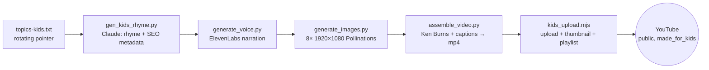

# Giggle Grove — Daily Kids-Rhyme Auto-Upload

End-to-end documentation for the automated system that produces and publishes one
"Made for Kids" rhyme video to YouTube every morning — script, voice, illustrations,
1080p render, upload, and playlist — with no human in the loop.

- **Deploy on a server:** [DOCKER.md](DOCKER.md)
- **CI/CD pipeline:** [JENKINS.md](JENKINS.md)
- **Voice provider chain internals:** see [hindi-history/tts_providers.py](hindi-history/tts_providers.py)

---

## 1. What it does

Every day at **08:00 IST** the pipeline generates a fresh Giggle Grove rhyme starring
Milo the fox, narrates it with **ElevenLabs**, illustrates all 8 scenes, renders a
**1920×1080** Ken Burns video with captions, uploads it **public / `made_for_kids=TRUE`**,
and adds it to the **"Giggle Grove Rhymes"** playlist.

## 2. Pipeline stages



| # | Stage | Script | Output |
|---|---|---|---|
| 1 | Rhyme + metadata | [hindi-history/gen_kids_rhyme.py](hindi-history/gen_kids_rhyme.py) | `data/epN.json` (title, description w/ hashtags, tags, 8 scenes) |
| 2 | Narration | [hindi-history/generate_voice.py](hindi-history/generate_voice.py) | `audio/epN_*.mp3` (+ durations) |
| 3 | Illustrations | [hindi-history/generate_images.py](hindi-history/generate_images.py) | `images/epN_sceneK.jpg` |
| 4 | Video assembly | [hindi-history/assemble_video.py](hindi-history/assemble_video.py) | `renders/epN.mp4` + thumbnail |
| 5 | Publish | [kids_upload.mjs](kids_upload.mjs) | live video + playlist entry |

The whole chain is orchestrated for one fresh episode by
[scripts/cron-kids-rhyme.sh](scripts/cron-kids-rhyme.sh), which picks the next topic,
computes the next episode number (`max(epN)+1`), loads ElevenLabs creds, and runs
stages 1–5. `set -e` aborts before upload if any stage fails, so a broken render is
never published.

## 3. Voice provider chain

Narration tries providers in priority order and locks onto the first that works, so an
episode has one consistent voice (see [hindi-history/tts_providers.py](hindi-history/tts_providers.py)):

**ElevenLabs → Google Cloud TTS → Gemini TTS → Edge TTS**

Edge TTS is free and needs no key, so it's the always-available safety net. ElevenLabs
is primary and is what the daily job uses.

## 4. Configuration

Secrets live in git-ignored `.env` files (never committed, never baked into images).

**`./.env`** (root — kids pipeline):

| Var | Purpose |
|---|---|
| `ANTHROPIC_API_KEY` | Claude writes the rhyme |
| `ELEVENLABS_API_KEY`, `ELEVENLABS_VOICE_ID`, `ELEVENLABS_MODEL` | narration voice |
| `YOUTUBE_CLIENT_ID`, `YOUTUBE_CLIENT_SECRET`, `YOUTUBE_REFRESH_TOKEN` | channel auth (upload + playlist scope) |
| `YOUTUBE_MOCK` | must be `0` for real uploads |
| `GEMINI_API_KEY` | TTS fallback |

**`./hindi-history/.env`** — history-side settings; only needed for the Google TTS
fallback (`GOOGLE_SERVICE_ACCOUNT_JSON`). ElevenLabs is primary, so usually optional.

**Runtime knobs:**

| Env | Default | Meaning |
|---|---|---|
| `KIDS_PRIVACY` | `public` | `public` \| `unlisted` \| `private` |
| `KIDS_PLAYLIST` | `Giggle Grove Rhymes` | playlist every upload is added to |
| `KIDS_ROOT` | auto | repo root override (set to `/app` in Docker) |
| `DRY_RUN` | `0` | `1` = print plan only, no generation/upload |

**Content:** edit [scripts/topics-kids.txt](scripts/topics-kids.txt) (one topic per
line) to change what gets made. The daily job walks the list and wraps around.

## 5. Running it

**Manually, one episode:**
```bash
scripts/cron-kids-rhyme.sh                 # generate + upload now
DRY_RUN=1 scripts/cron-kids-rhyme.sh       # plan only, no cost
```

**Per stage** (e.g. episode 101):
```bash
cd hindi-history
.venv/bin/python gen_kids_rhyme.py  --episode 101 --topic "Learn colors with Milo"
.venv/bin/python generate_voice.py  --episode 101 --scenes-file data/ep101.json
.venv/bin/python generate_images.py --episode 101 --scenes-file data/ep101.json
.venv/bin/python assemble_video.py  --episode 101 --scenes-file data/ep101.json --thumb-scene 1
cd .. && node kids_upload.mjs 101 public
```

## 6. Automation options

| Where | Mechanism | Doc |
|---|---|---|
| Local machine | `crontab` entry `0 8 * * *` → `scripts/cron-kids-rhyme.sh` | already installed |
| Server (EC2) | Docker container + supercronic | [DOCKER.md](DOCKER.md) |
| CI/CD | Jenkins: push → build → deploy | [JENKINS.md](JENKINS.md) |

Deployment topology today: build the Docker image, run it with secrets mounted; the
container's supercronic fires the 08:00 job. Jenkins automates build+deploy on every
push (GitHub webhook, with a 15-min poll fallback).

## 7. Operations & troubleshooting

| Symptom | Check |
|---|---|
| No video appeared | `logs/cron-kids-rhyme.log` (host) or `docker compose logs` |
| Voice sounds wrong | provider line in the log — should say `Voice provider: elevenlabs` |
| Upload failed | `YOUTUBE_MOCK` must be `0`; refresh token valid + has upload scope |
| Playlist not updated | token needs playlist scope — re-run `npm run youtube:auth` |
| Images time out | Pollinations is flaky; the run retries. A full failure aborts before upload |
| Captions look boxed/missing | Devanagari/Latin fonts must be installed (Docker installs them) |

## 8. Important: one channel, two pipelines

The kids pipeline and the Hindi-history pipeline **publish to the same YouTube channel**
("Minimagictvvv"), even though the code treats them as separate. **Any bulk operation
(e.g. "delete everything") affects both.** Always enumerate the real video list before
any deletion — see [list_kids_videos.mjs](list_kids_videos.mjs).

## 9. Related docs

- [README.md](README.md) — the original content-generation stage (TS/Gemini)
- [docs/PROJECT_DOCS.md](docs/PROJECT_DOCS.md), [docs/PRODUCTION_WORKFLOW.md](docs/PRODUCTION_WORKFLOW.md) — the broader kids-channel brief
- [DOCKER.md](DOCKER.md) · [JENKINS.md](JENKINS.md)
